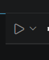

# Retromatic
## Intro 
Rétromatic est une application dans le thème retro/futuriste space age dans lequel vous trouverez 4 mini-jeux. Les Thèmes 
des jeux sont principalement inspirés du célèbre film GATTACA de 1997 et de la célèbre franchise Fallout.

### Lancer le projet
Pour utiliser le projet, assurez-vous d'avoir Java et JavaFX d'installés sur votre appareil.
Puis cliqué sur le bouton play en haut à droite de l'IDE.


Amusez-vous

## Jeux Présents
- 2048
- hangman
- memory
- sudoku

## Arborescence du projet
```text
Retromatic/
├── .classpath
├── .gitignore
├── .project
├── README.md
├── image.png
├── backend/
│   ├── AccueilController.java
│   ├── HomeController.java
│   ├── main.java
│   ├── fusion/
│   │   ├── FusionController.java
│   │   └── FusionModel.java
│   ├── hangman/
│   │   ├── DatabaseHelper.java
│   │   ├── HangmanController.java
│   │   └── HangmanModel.java
│   ├── memory/
│   │   ├── MemoryController.java
│   │   └── MemoryModel.java
│   └── sudoku/
│       ├── SudokuController.java
│       ├── SudokuDatabaseHelper.java
│       └── SudokuModel.java
├── frontend/
│   ├── accueil.css
│   ├── accueil.fxml
│   ├── background_accueil/
│   │   └── standby.jpg
│   ├── fusion.css
│   ├── fusion.fxml
│   ├── hangman.css
│   ├── hangman.fxml
│   ├── home.fxml
│   ├── memory.css
│   ├── memory.fxml
│   ├── memory_back.jpg
│   ├── memory_card/
│   │   ├── First Contact.jpg
│   │   ├── Irene.jpg
│   │   ├── Josef.jpg
│   │   ├── The Computer Room.jpg
│   │   ├── The GMO.jpg
│   │   ├── The Office.jpg
│   │   ├── The Swim.jpg
│   │   └── Vincent.jpg
│   ├── sudoku.css
│   └── sudoku.fxml 
```